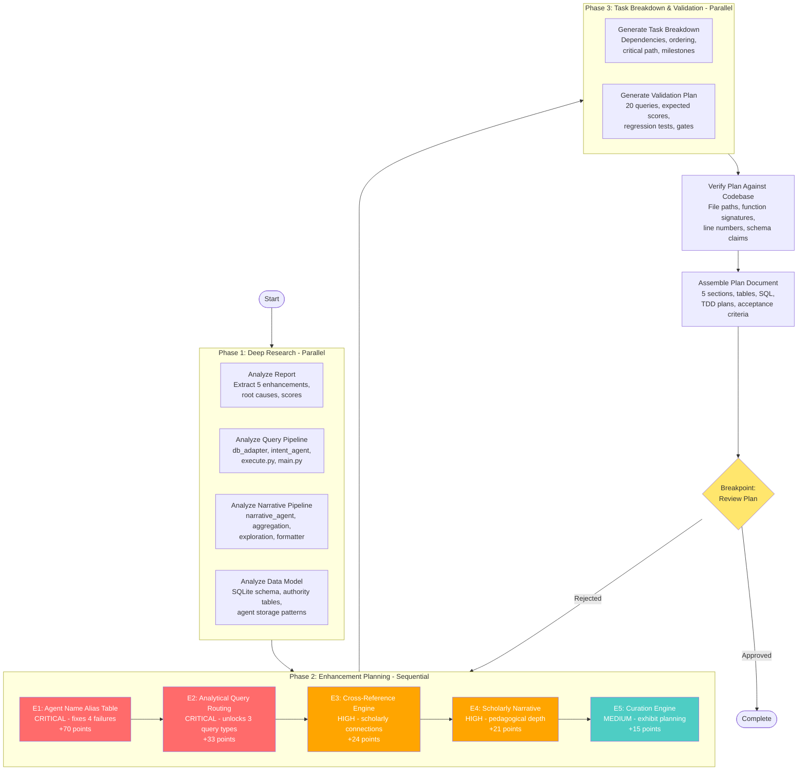
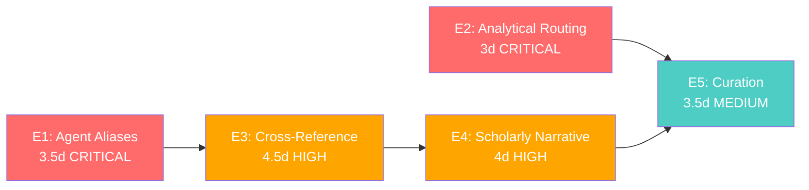

# Historian Enhancement Plan — Process Flow



## Legend

| Color | Meaning |
|-------|---------|
| Red | CRITICAL priority |
| Orange | HIGH priority |
| Teal | MEDIUM priority |
| Yellow | Breakpoint (human review) |

## Task Count by Phase

| Phase | Tasks | Parallel? | Dependencies |
|-------|-------|-----------|-------------|
| Phase 1 | 4 | Yes (all parallel) | None |
| Phase 2 | 5 | No (sequential) | Phase 1 research |
| Phase 3 | 2 | Yes (parallel) | Phase 2 plans |
| Phase 4 | 1 | N/A | Phase 3 outputs |
| Phase 5 | 1 | N/A | Phase 4 verification |
| **Total** | **13 agent tasks + 1 breakpoint** | | |

## Enhancement Dependency Graph



## Score Projection

```
Baseline:       ████░░░░░░░░░░░░░░░░  7.55/25 (30%)  — 7 FAIL queries
After E1+E2:    ██████████░░░░░░░░░░  12.70/25 (51%) — highest ROI
After E1-E3:    ████████████░░░░░░░░  13.90/25 (56%)
After E1-E4:    █████████████░░░░░░░  14.95/25 (60%)
After All:      ██████████████░░░░░░  15.70/25 (63%) — 0 FAIL queries
```
